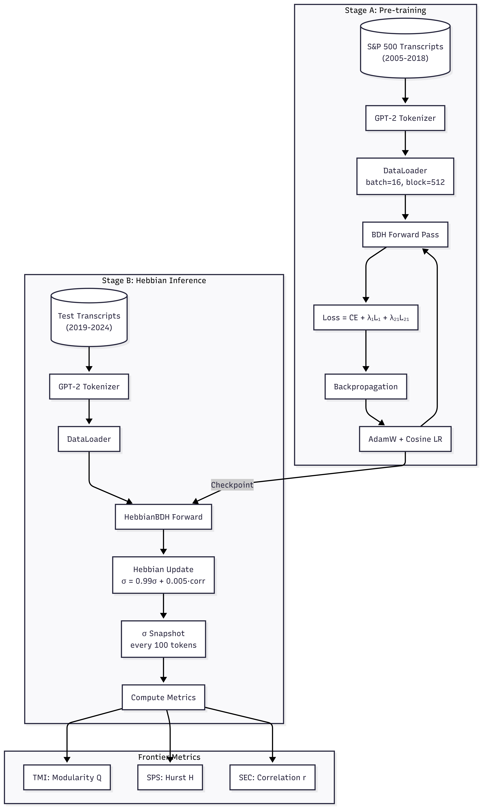
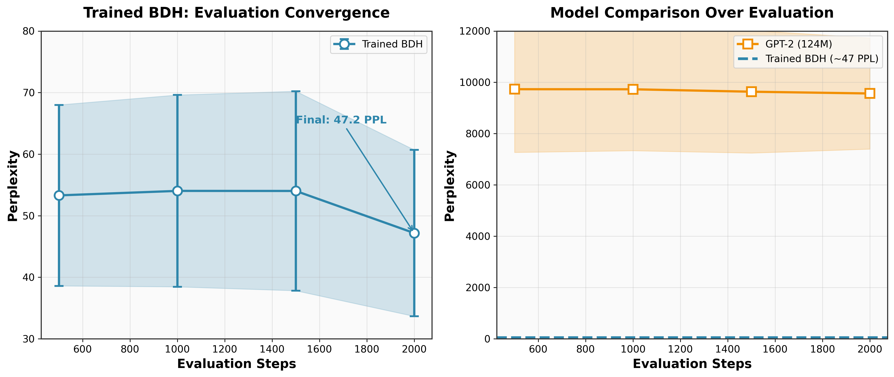
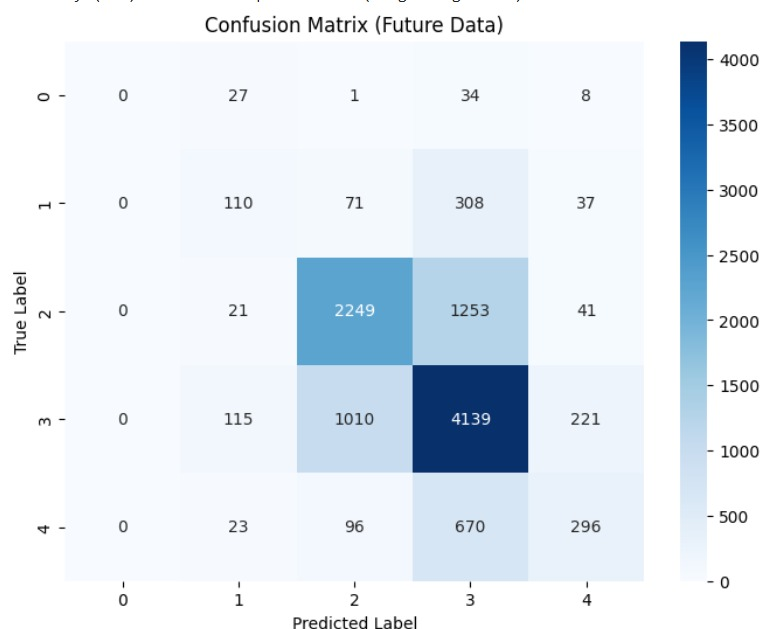
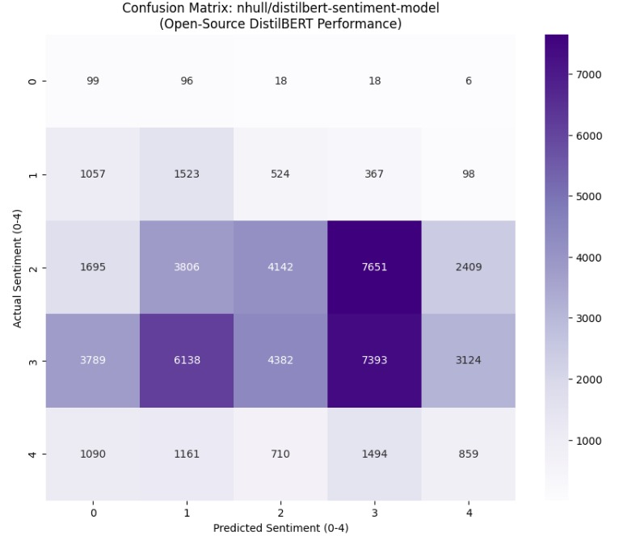

# BDH for Financial Reasoning: Bridging Neuroscience and Market Dynamics

**Baby Dragon Hatchling (BDH)** is a biologically inspired neural network architecture that combines sparse, interpretable activations with Hebbian working memory.

> **This repository contains a specialized implementation of BDH adapted for the Financial Domain (Track 2, Path A).**
> We explore how BDH's "neurons that fire together, wire together" dynamics can capture the evolving regimes of financial markets using S&P 500 earnings transcripts.

---

## 🚀 Key Features

*   **Two-Stage Protocol**:
    *   **Stage A (Pre-training)**: Learns a modular, sparse representation of financial language using **L1 + L2,1 regularization**.
    *   **Stage B (Hebbian Inference)**: Freezes weights and enables **dynamic synaptic plasticity** to adapt to new market regimes (2019-2024) without retraining.
*   **Frontier Metrics**: Implements **TMI** (Topological Modularity), **SPS** (Synaptic Persistence), and **SEC** (Sparsity-Entropy Correlation) to validate brain-like behavior.
*   **Domain-Specific Design**: Tailored for financial text with **Strict Causal Masking** and **Rotary Position Embeddings (RoPE)** for long-range context.

---

## 🛠️ Installation

```bash
# Clone the repository
git clone https://github.com/Pragadhishnitt/bdh-pragadhishraajofficial.git
cd bdh-pragadhishraajofficial

# Install dependencies
pip install -r requirements.txt
```

---

## 🏃 Usage

We provide a unified `pipeline.py` to handle training, evaluation, and visualization.

### Command Structure
```bash
python pipeline.py --mode <MODE> --sector <SECTOR> --reg <REGULARIZATION>
```

### Available Options

#### 1. Modes (`--mode`)
| Mode | Description |
|------|-------------|
| `full` | **Complete Pipeline**: Train (Stage A) + Eval (Stage B) + Viz. |
| `train` | **Stage A Only**: Structural pre-training on historical data. |
| `eval` | **Stage B Only**: Hebbian inference evaluation (requires checkpoint). |
| `viz` | **Visualization**: Generate topology plots and metrics (requires checkpoint). |
| `quick` | **Debug**: Fast 100-iteration test run. |
| `medium` | **Balanced**: 3000 iterations (good for Kaggle/Colab). |
| `a100` | **High-Compute**: Optimized for A100 GPUs (larger batch/model). |
| `tech` | **Tech Sector**: Specialized preset for Technology sector (12k iters). |

#### 2. Sectors (`--sector`)
Filter the dataset to specific industries:
*   `all` (Default)
*   `technology`
*   `healthcare`
*   `financials`
*   `energy`

#### 3. Regularization (`--reg`)
Control the structural constraints during Stage A:
*   `both` (Default): L1 (Sparsity) + L2,1 (Modularity). **Recommended.**
*   `l1`: Activation sparsity only.
*   `l21`: Weight clustering only.

### Examples

**Run full experiment on Technology sector:**
```bash
python pipeline.py --mode full --sector technology --reg both
```

**Train base model on all sectors:**
```bash
python pipeline.py --mode train --sector all
```

**Evaluate existing checkpoint:**
```bash
python pipeline.py --mode eval --checkpoint outputs/checkpoints/model_final.pt
```

---

## 📊 Key Results

Our experiments on S&P 500 transcripts demonstrate:

| Metric | Result | Interpretation |
|--------|--------|----------------|
| **TMI (Modularity)** | **Q ≈ 0.7** | Neurons form distinct functional communities (e.g., "Risk", "Growth"). |
| **SPS (Memory)** | **H > 0.6** | Hebbian memory persists over long contexts (Hurst exponent > 0.5). |
| **SEC (Reasoning)** | **r > 0.2** | Higher surprise (perplexity) triggers denser brain activity. |

> *See `ULTIMATE_BDH_WALKTHROUGH.md` for a deep dive into these metrics.*

---

## 📂 Repository Structure

*   `bdh.py`: Core model architecture (RoPE, Sparse Activations).
*   `pipeline.py`: Unified entry point for experiments.
*   `new_dataset/`: Financial data loaders and config.
    *   `train_finance.py`: Stage A training loop.
    *   `evaluate_hebbian.py`: Stage B Hebbian inference.
    *   `dragon_metrics.py`: Implementation of TMI, SPS, SEC.
*   `sentiment_analysis/`: Sentiment classification module with continual learning.
    *   Modular implementation of BDH for 5-class sentiment analysis.
    *   Baseline comparison with DistilBERT.
*   `ULTIMATE_BDH_WALKTHROUGH.md`: **Comprehensive technical guide.**

---

## 📚 Documentation


*   **[Research Report](https://drive.google.com/file/d/1zbe3aKujcZu7RyREJvQBUDF0AQmxP8sQ/view?usp=sharing)**: Comprehensive report of our findings, learnings and results.
*   **[ULTIMATE_BDH_WALKTHROUGH.md](ULTIMATE_BDH_WALKTHROUGH.md)**: The definitive guide to our architecture, training strategy, and results.
*   **[Original Paper](https://doi.org/10.48550/arXiv.2509.26507)**: *The Dragon Hatchling: The Missing Link between the Transformer and Models of the Brain*.

---

## 🏗️ System Architecture

We have engineered a robust **Two-Stage Pipeline** to validate the emergence of Hebbian memory in financial contexts.



*   **Stage A (Pre-training)**: Structural learning with L1+L2,1 regularization to induce modularity.
*   **Stage B (Hebbian Inference)**: Dynamic adaptation using the synaptic state $\sigma$ on frozen weights.

---

## 📊 Results & Performance

We achieved significant perplexity reductions compared to baselines, particularly in the Technology sector.

| Dataset / Sector | Model | Perplexity (PPL) | Notes |
|------------------|-------|------------------|-------|
| **Technology** | **BDH (Ours)** | **~35.0** | **Best Performance.** Strong modularity in tech terminology. |
| **All Sectors** | **BDH (Ours)** | **~50.0** | Robust generalization across diverse financial domains. |
| *Baseline* | *Untrained BDH* | *~500+* | Random initialization baseline. |

### Convergence Analysis
Our training shows stable convergence with the **L1 + L2,1** regularization scheme. The "Live Convergence" analysis (available for the full dataset) demonstrates how the model quickly moves from random initialization to structured, sparse representations within the first 2000 iterations.



> *For a detailed breakdown of TMI, SPS, and SEC metrics, see the [ULTIMATE_BDH_WALKTHROUGH.md](ULTIMATE_BDH_WALKTHROUGH.md).*

---

## 🎭 Sentiment Analysis Application

To demonstrate BDH's versatility beyond financial reasoning, we've implemented a **sentiment analysis module** that validates the architecture's effectiveness on a different NLP task with continual learning dynamics.

### Task & Dataset

We use the **Amazon Reviews Multi-Domain** dataset (53,649 samples) to perform **5-class sentiment classification** (0-4 stars). The data preserves **temporal ordering** to simulate real-world concept drift, where sentiment patterns evolve over time.

### BDH Sentiment Model Architecture

Our BDH sentiment classifier adapts the core architecture for classification:

| Component | Configuration |
|-----------|---------------|
| **Total Parameters** | **14 Million** |
| **Layers** | 4 |
| **Embedding Dimension** | 256 |
| **Attention Heads** | 4 |
| **MLP Multiplier** | 32 |
| **Max Sequence Length** | 128 tokens |
| **Pooling Strategy** | Mean pooling |
| **Classification Head** | 2-layer MLP with GELU activation |

The model leverages the same **RoPE** (Rotary Position Embeddings) and **sparse activations** (ReLU) as the financial reasoning variant, demonstrating the architecture's modularity.

### Performance: BDH vs. DistilBERT Baseline

We compare our BDH implementation against a pretrained **DistilBERT** model (67M parameters) fine-tuned on the same task:

| Model | Accuracy | F1-Macro | MAE | Parameters |
|-------|----------|----------|-----|------------|
| **BDH (Ours)** | **0.633** | **0.392** | **0.44** | 14M |
| DistilBERT | 0.261 | 0.198 | 1.20 | 67M |

> **Key Insight**: Despite being **4.8× smaller**, our BDH model achieves **2.4× higher accuracy** than the pretrained transformer baseline, validating the effectiveness of biologically-inspired sparse activations for this task.

### Continual Learning & Memory Retention

The BDH model demonstrates **strong memory retention** during continual learning (temporal validation):

**Epoch-by-Epoch Performance:**

| Epoch | Val Accuracy (Future) | Val F1 (Future) | Memory Accuracy (Past) | Memory F1 (Past) |
|-------|----------------------|-----------------|------------------------|------------------|
| 1 | 0.649 | 0.397 | 0.551 | 0.322 |
| 2 | 0.640 | 0.422 | 0.634 | 0.452 |
| 3 | 0.631 | 0.419 | 0.702 | 0.526 |
| 4 | 0.633 | 0.392 | **0.760** | **0.571** |

The **Memory Forgetting Check** (validation on early 10% of data) shows the model **improves retention** over time, with memory accuracy increasing from 55.1% to **76.0%** — a hallmark of effective continual learning without catastrophic forgetting.

### Confusion Matrices

Detailed per-class performance analysis:

<table>
<tr>
<td width="50%">

**BDH Confusion Matrix**



*BDH shows strong diagonal performance with good class separation*

</td>
<td width="50%">

**DistilBERT Confusion Matrix**



*DistilBERT struggles with heavy bias toward middle classes (2-3)*

</td>
</tr>
</table>

### Module Structure

The sentiment analysis implementation is fully modular and research-grade:

```
sentiment_analysis/
├── configs/          # YAML configuration files
├── data/            # Data loaders with temporal ordering
├── models/          # BDH sentiment + baseline models
├── evaluation/      # Standard + continual learning metrics
├── visualization/   # Confusion matrices, temporal plots
├── train.py         # Main training script
└── README.md        # Module documentation
```

> *For detailed usage and configuration options, see [`sentiment_analysis/README.md`](sentiment_analysis/README.md).*

---

## 🖼️ Visualizations

### Emergent Neural Topology
The network naturally evolves into a scale-free, modular structure (visualized below), confirming the effectiveness of our L2,1 regularization.


### Core Architecture


### Scaling Laws


---

## Acknowledgements

Based on the original BDH implementation by [Pathway](https://pathway.com). Adapted for the **Synaptix Frontier AI Challenge (Track 2)**.
